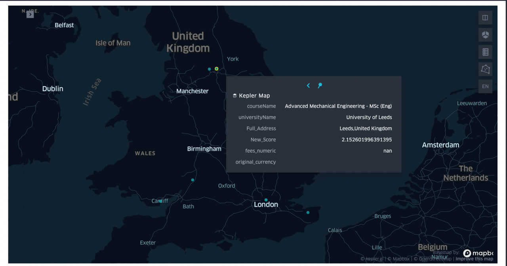

# Homework 3 - Master's Degrees from all over!

This repository devoted to provide detailed answers to [Homework 3 - Master's Degrees from all over!](https://github.com/Sapienza-University-Rome/ADM/tree/master/2023/Homework_3). The repository is organized as follows:

## Files description

1. __`main.ipynb`__: 
	> It is the main file where all Questions of ADM_HW3 are answered and contains the analysis. It is a `IPython Notebook` file.

2. __`CommandLine.sh`__: 
	> It is a `bash` script that give an answer to CLQ question.

In case the map is not visible, here how it looks like.

Our group#17:

* Begaiym Satarova
satarova.2056861@studenti.uniroma1.it
* Raffaele Cannarsa
cannarsa.1923456@studenti.uniroma1.it 
* Matteo Grimaldi
grimaldi.1849945@studenti.uniroma1.it
* Adilkhan Bakridenov
bakridenov.2105666@studenti.uniroma1.it
